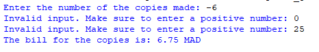

## Description
This program calculates the cost of photocopies, and displays the total bill in Moroccan Dirhams (MAD). It calculates the cost according to the following rules:
- If the number of copies is 10 or less, each copy costs 0.30 MAD.
- If the number of copies is between 11 and 30 (inclusive), the first 10 copies cost 0.30 MAD each, and the rest cost 0.25 MAD each.
- If the number of copies is over 30, the first 10 copies cost 0.30 MAD each, the next 20 cost 0.25 MAD each, and the remaining copies cost 0.20 MAD each.
- If the number is less than 1, the user will be asked to reenter a positive number.
## Example

